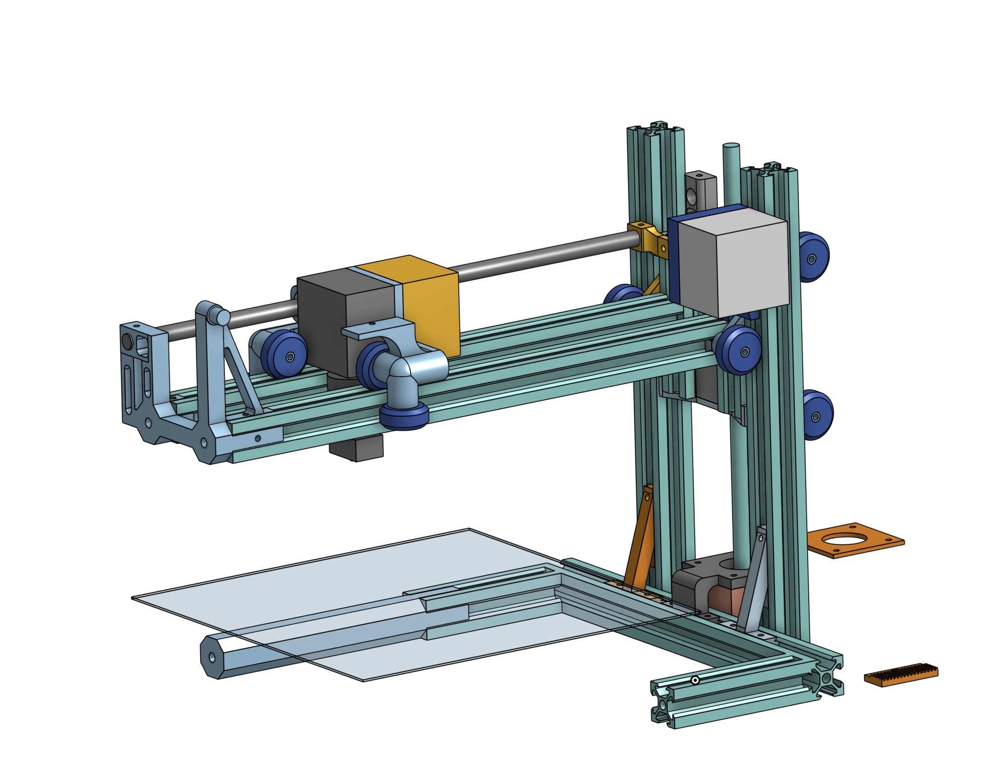
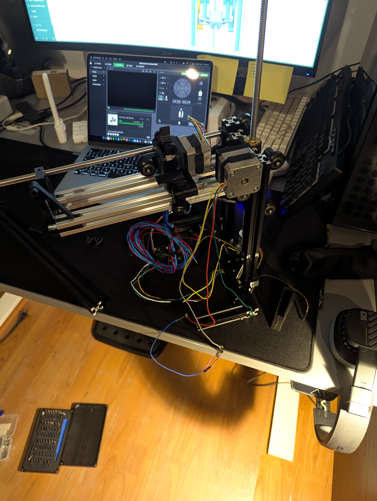

# Custom 3D Printer

A custom-designed FDM 3D printer developed as part of my International Baccalaureate (IB) MYP Personal Project.

Rather than assembling a commercial kit, this project focused on understanding the engineering principles behind desktop 3D printers by designing the mechanical system, selecting components, planning the budget, and carrying out the assembly process from the ground up.

Although originally created for my IB MYP Personal Project, development has continued beyond the academic assessment and remains an active long-term engineering project.

---

## Project Status

🚧 **Currently Under Development**

The printer is still being refined and has undergone several design iterations since the completion of the original project report.

Recent improvements include:

- Redesigned X-axis assembly
- Increased structural rigidity
- Replacement of failed components
- Continued mechanical refinement
- Ongoing calibration and testing

The Onshape project always contains the latest version of the design.

---

## Features

- Custom-designed FDM 3D printer
- Fully modeled CAD assembly
- Mechanical design from scratch
- Component selection and budgeting
- Engineering documentation
- Continuous iterative development

---

## CAD Model

The complete CAD model is publicly available on Onshape.

**View the latest CAD model here:**

> *(Insert your Onshape link here)*

The Onshape document contains the latest version of the project, including all Part Studios, Assemblies, and ongoing design revisions.

---

## Documentation

A comprehensive engineering report produced for my IB MYP Personal Project is included in this repository.

The report covers:

- Project planning
- Engineering research
- Design decisions
- CAD development
- Budgeting
- Assembly process
- Testing and troubleshooting
- Challenges encountered
- Reflections
- Future improvements

📄 **Report**

```
docs/MYP_Personal_Project_Report.pdf
```

> **Note:** The report reflects the state of the project at the time of submission (March 2024). Development has continued significantly since then, and the current design is more advanced than the version documented in the report.

---

## Images

Current progress of CAD


Current progress of Build


---

## Technologies & Tools

- Onshape
- FDM 3D Printing
- CAD
- Mechanical Design
- Project Planning
- Engineering Documentation

---

## Future Work

Planned improvements include:

- Complete mechanical assembly
- Full system calibration
- Cable management improvements
- Print quality optimization
- Structural refinements
- Successful first print

---

## License

This project is licensed under the MIT License.

Any third-party CAD models, manufacturer datasheets, or documentation included in this repository remain the property of their respective owners.
